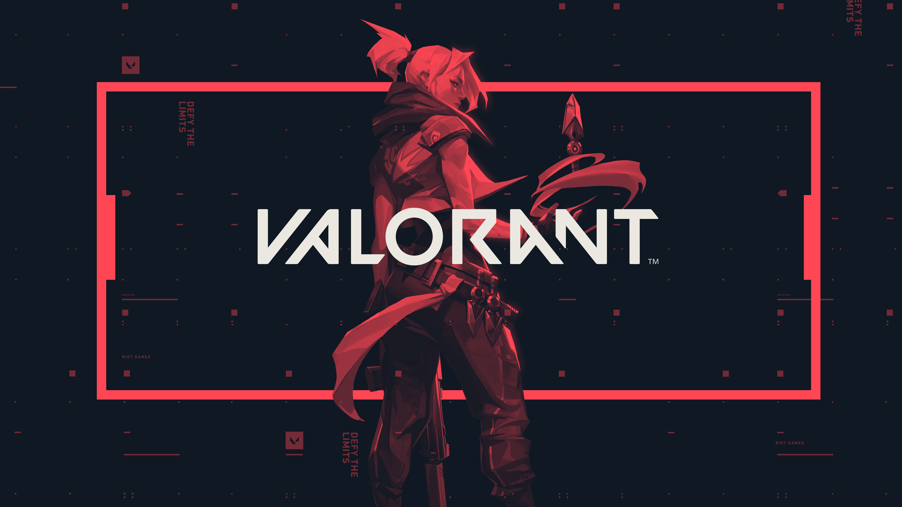

# Important note: This is no longer functional

<h1 align="center">
  
  <br />
  Valorant
</h1>

<p align="center"><b>This is the snap for valorant</b>, <i>"valorant is a FPS 5x5 game developed by Riot Games"</i>. It works on Ubuntu, Fedora, Debian, and other major Linux
distributions.</p>

## Mandatory

**Note:** This is for current users only before upgrading valorant snap as of `25 Jan 2020`

* Needed steps to migrate valorant snap to use `wine 5.0` before upgrading valorant snap.

```
    snap disconnect valorant:wine-4-staging
    snap remove wine-platform-4-staging
    snap refresh --edge --devmode valorant
    snap install wine-platform-5-staging
    snap refresh --candidate wine-platform-5-staging
    snap connect valorant:wine-5-staging wine-platform-5-staging
```

* Also create fresh `WINEPREFIX` after doing all above steps and see pinned issue `Important Notice` for guide.

## Install

    snap install --edge valorant
    snap refresh --candidate wine-platform-runtime
    snap refresh --candidate wine-platform-5-staging

## Optional
Users can update `wine-platform-runtime` snap which has updated pkgs like `mesa`,` llvm`, `amd`,`intel`, drivers from `obif` ppa that can support newer `AMD` gpus and newer changes.

	snap refresh --beta wine-platform-runtime

([Don't have snapd installed?](https://snapcraft.io/docs/core/install))

 ## Known Issues and fixes for them:
 
 ### Game not starting (Unhandled exception and MIDIMAP_drvOpen in lol ver 9.21):
 Issues with the new launcher. You can temporarily disable it this way:
1. Let the game fully install and update.
2. Make sure client is not running.
3. When you have fully updated game then run this command on terminal to block new launcher from executing.
4. After this command launch game as usual. I'm not sure how longer this method will work.
NOTE: Before executing this command make sure launcher has installed new launcher update.
`for f in RiotClientServices.exe RiotClientCrashHandler.exe; do sudo chmod 0 "$HOME/snap/valorant/common/.wine/drive_c/Riot Games/Riot Client/$f"; sudo chown root:root "$HOME/snap/valorant/common/.wine/drive_c/Riot Games/Riot Client/$f"; done`

### Game crashing after character select (lol ver 9.20):
Refresh the wine-platform-runtime with:

    snap refresh --candidate wine-platform-runtime
    
Eventually reinstall the game and the game-snap with:

	snap remove valorant && snap install --devmode --edge valorant
    
### Game won't install (and will crash instead):
The emulated version of Windows is probably set to Win7 in wine (it will change back to Win7 after reinstallation of the valorant snap). Change it to Win XP by running:

    valorant.winecfg


Support me by donating via [Pateron](https://www.patreon.com/mmtrt)

Thanks for supporting me, **Ignacy , Tomasz** 



[](https://snapcraft.io/valorant)

